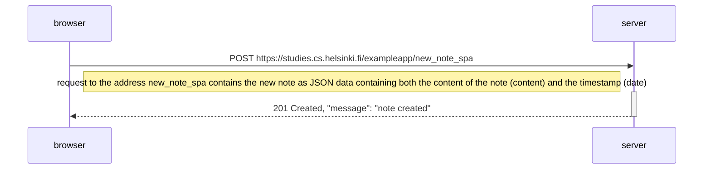

```mermaid
    sequenceDiagram
        participant browser
        participant server

        browser->>server: POST https://studies.cs.helsinki.fi/exampleapp/new_note_spa
        Note right of browser: request to the address new_note_spa contains the new note as JSON data containing both the content of the note (content) and the timestamp (date)

        activate server
        server-->>browser: 201 Created, "message": "note created"
        deactivate server

```